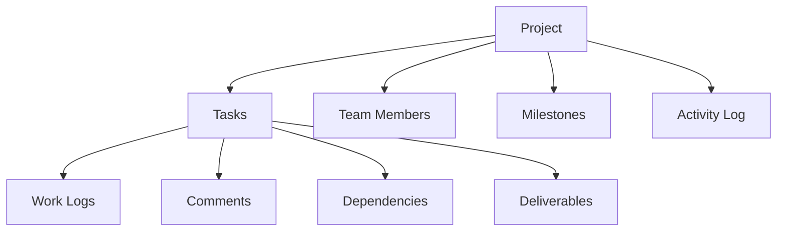

# Comprehensive Diamond Transpiler

A blockchain-based project management and collaboration platform leveraging smart contract technology for transparent, secure, and efficient team workflows.

## Overview

LatticeChain provides a comprehensive project management platform that leverages blockchain technology to create immutable records of project activities, task assignments, and completions. The system offers:

- Project creation and management
- Task tracking with dependencies
- Milestone management
- Team member roles and permissions
- Work logging and time tracking
- Task comments and deliverables
- Immutable activity logging

## Architecture

The system is built around a core smart contract that manages all project-related data and operations. Here's how the main components interact:



## Contract Documentation

### Core Contract (latticechain-core.clar)

The main contract that handles all project management functionality.

#### Key Features:
- Project lifecycle management
- Task tracking and dependencies
- Team member management with role-based access
- Milestone tracking with completion status
- Work logging and time tracking
- Activity logging for audit trail

#### Role Hierarchy:
1. Owner (highest permissions)
2. Manager
3. Contributor
4. Viewer (lowest permissions)

## Getting Started

### Prerequisites
- Clarinet
- Stacks wallet
- Node.js environment

### Installation

1. Clone the repository
2. Install dependencies
```bash
clarinet install
```
3. Run tests
```bash
clarinet test
```

## Function Reference

### Project Management

```clarity
(create-project (title (string-utf8 100)) 
                (description (string-utf8 500))
                (start-date uint)
                (end-date uint)
                (budget uint))
```

```clarity
(update-project (project-id uint)
                (title (string-utf8 100))
                (description (string-utf8 500))
                (status uint)
                (start-date uint)
                (end-date uint)
                (budget uint))
```

### Task Management

```clarity
(create-task (project-id uint)
             (title (string-utf8 100))
             (description (string-utf8 500))
             (assignee (optional principal))
             (priority uint)
             (estimated-hours uint)
             (start-date uint)
             (due-date uint)
             (milestone-id (optional uint)))
```

```clarity
(update-task-status (project-id uint)
                    (task-id uint)
                    (new-status uint))
```

### Team Management

```clarity
(add-team-member (project-id uint)
                 (member principal)
                 (role uint))
```

```clarity
(update-team-member-role (project-id uint)
                        (member principal)
                        (new-role uint))
```

## Development

### Testing

Run the test suite:
```bash
clarinet test
```

### Local Development

1. Start local chain:
```bash
clarinet integrate
```

2. Deploy contracts:
```bash
clarinet deploy
```

## Security Considerations

1. Role-based access control
   - All sensitive operations require appropriate permissions
   - Owner role cannot be transferred or removed

2. Data Validation
   - All inputs are validated before processing
   - Status transitions are properly controlled

3. Dependency Management
   - Circular dependencies are prevented
   - Task dependencies must be completed before dependent tasks can start

4. State Management
   - Critical state changes are atomic
   - Activity logging provides audit trail

5. Known Limitations
   - No bulk operations supported
   - Cannot delete projects or tasks (only cancel)
   - File storage must be handled off-chain